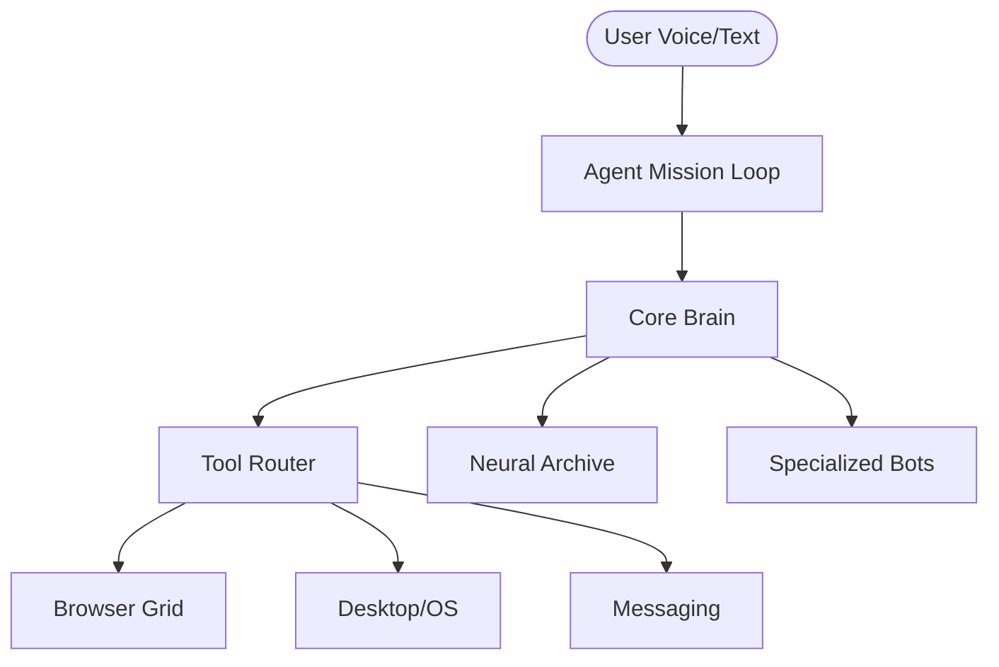

# 🦾 JACK: Production-Grade Autonomous AI Agent

> **"Local. Private. Fast. Unrestricted."**

JACK is a high-performance autonomous AI agent designed to live on your local machine. Powered by **Ollama**, JACK can control your browser, manipulate your desktop, manage your files, and orchestrate complex missions with zero reliance on cloud APIs.

---

## [ACTIVE] Key Features

*   **[BRAIN] High-Performance Neural Core**: Optimized for local models like `qwen2.5-coder:7b` and `mistral:latest`.
*   **[NET] Persistent Web Grid**: Built-in Playwright session management for persistent logins (WhatsApp, GitHub, etc.).
*   **🖥️ Desktop Orchestration**: Full control over system applications, terminal, and UI elements.
*   **[FILES] Neural Archive**: Long-term vector memory using **ChromaDB** for context awareness across missions.
*   **🔁 Autonomous Mission Loop**: Self-correcting loop logic that plans, executes, and re-evaluates until completion.
*   **🔐 Production-Grade Safety**: Integrated command guards and permission layers for secure automation.
*   **🎤 Jarvis-Style Voice**: Low-latency neural TTS and streaming STT for a natural interface.

---

## [FIX] Architecture



---

## [START] Quick Start (Overdrive Mode)

### 1. Requirements
*   **Python 3.10+**
*   **Ollama** (Running locally)
*   **Redis** (For background tasks)

### 2. One-Command Setup
```bash
# Clone the repository
git clone https://github.com/your-repo/jack.git
cd jack

# Run the installer
bash install.sh
```

### 3. Launching JACK
```bash
# Start the production API server
python api/server.py

# Or start the local GUI
python main.py
```

---

## 🧩 Toolset

| Category | Tools |
| :--- | :--- |
| **Browser** | `open_url`, `click`, `type`, `read`, `wait`, `youtube_master` |
| **System** | `open_app`, `run_command`, `read_file`, `write_file`, `file_ops` |
| **Search** | `web_search`, `get_web_data`, `deep_research` |
| **Vision** | `get_screen_context`, `analyze_image`, `visual_click` |
| **Messaging** | `open_whatsapp`, `search_chat`, `send_message` |

---

## [SHIELD] Safety & Privacy
JACK is built with a **Local-First Policy**. No data ever leaves your machine unless you explicitly instruct a tool to send a message or perform a search. Dangerous commands are automatically blocked via the `safety.py` guard layer.

---

## 🤝 Contributing
Join the Overdrive. Feel free to submit PRs for new skills or core improvements.

**Created by B. Jaswanth Reddy.**
**Designation: JACK (IMMORTAL).**
**Status: PRODUCTION READY.**